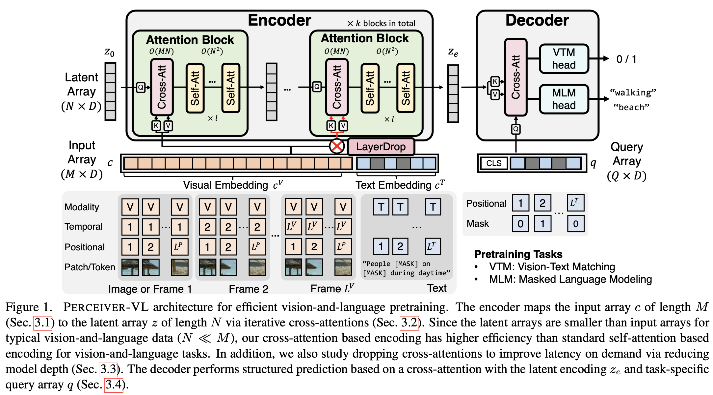

# Perceiver-VL

### **[PERCEIVER-VL: Efficient Vision-and-Language Modeling with Iterative Latent Attention]() [WACV 2023 [bib](https://github.com/zinengtang/Perceiver_VL#citation)]**  
[Zineng Tang*](https://zinengtang.github.io/), [Jaemin Cho*](https://j-min.io/), [Jie Lei*](https://jayleicn.github.io/), [Mohit Bansal](https://www.cs.unc.edu/~mbansal/)   

Learning vision-language representation by iterative latent attention that scales with long inputs linearly.

## Introduction
<!-- <p align="center">
  <big><b>PERCEIVER-VL: Efficient Vision-and-Language Modeling with Iterative Latent Attention (WACV 2023)</b></big>
</p>


<p align="center">
  <big><b>Zineng Tang, Jaemin Cho, Jie Lei, Mohit Bansal</b></big>
</p> -->

Perceiver-VL Architecture Overview

<p align="center">
  
</p>


## Install
### Setup `python` environment
```
conda create -n Perceiver-VL python=3.8   # You can also use other environment.
```

### Install other dependencies
```
pip install -r requirements.txt
```


## Training

### Pretraining (scripts)

```
# Example
bash scripts/co_pretrain.sh
```

### Finetuning on Downstream (scripts)

```
# Example
bash scripts/msrvtt_vrtr_finetune.sh
```

## Released Models

The model weights are hosted in [Huggingface Hub](https://huggingface.co/Perceiver-VL/models/tree/main).  

The details of each released Perceiver-VL models are described in the table below.  

| Training    | Component | Link |
| --- | --- | --- | --- |
| Pre-trained on Webvid + GCC videos and images|Encoder + Decoder|[[link]](https://huggingface.co/Percever-VL/models/resolve/main/Percever-VL.ckpt)|


## Folder Structure

See [Folder Structure](CODE.md)

## Citation
```
@inproceedings{tang2023wacv,
  title     = {PERCEIVER-VL: Efficient Vision-and-Language Modeling with Iterative Latent Attention},
  author    = {Zineng Tang and Jaemin Cho and Jie Lei and Mohit Bansal},
  booktitle = {WACV},
  year      = {2023}
}
```

## Acknowledgement

Our codebase is based on [ViLT](https://github.com/dandelin/ViLT). 
We thank the authors for their open-source contributions.

## Contact

Zineng Tang (zn.tang.terran@gmail.com)

